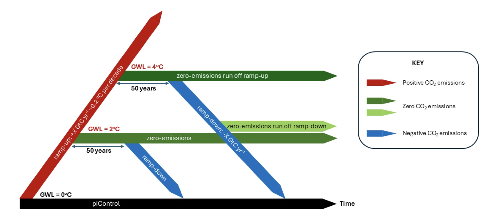

# Datasets

The analyses are based on datasets from model experiments using UKESM or its model components, such as the CANARI HadGEM3 Large Ensemble or the TerraFirma UKESM TIPMIP experiment, as well as observations and reanalyses.

## Model experiments
### CANARI HadGEM3 Large Ensemble
The CANARI-LE (Schiemann et al., 2026) consists of 40 ensemble members of both the CMIP6 historical (1950-2014) simulation and SSP3-7.0 (2015-2100). The simulations have been completed with HadGEM3-GC1.3-MM, with the same configuration as used in CMIP6 (global configuration version 3.1).

Model details

* Model: HadGEM3-GC1.3-MM, same configuration as used in CMIP6, global configuration version 3.1
* Atmosphere: UM
* Ocean: NEMO3.6
* Sea Ice: CICE
* Land: Jules

Data access

* 
* 
More information on the CANARI-LE can be found on the [here](https://ncas-cms.github.io/canari/).

### TerraFirma UKESM TIPMIP experiment
The Terrafirma Overshoot ensemble follows the TIPMIP protocol (Jones et al., 2025), which defines a set of climate model experiments that include (i) idealised warming experiments (CO2 increase only), (ii) CO2 stabilisation experiments at various global warming levels and (iii) ramp-down experiments with a simulated CO2 decrease (Fig. 1, Jones et al. 2025). These TIPMIP experiments have been completed with UKESM1.2.

<figure>
  
  <figcaption><strong>Figure 1:</strong> The TIPMIP Tier 1 Earth system model (ESM) experiment protocol. ESMs are run in CO2 emission mode with predicted atmospheric CO2 concentration and a full carbon cycle.</figcaption>
</figure>

<!--<figure>
  
  <figcaption><strong>Figure 1:</strong> The TIPMIP Tier 1 Earth system model (ESM) experiment protocol. ESMs are run in CO2 emission mode with predicted atmospheric CO2 concentration and a full carbon cycle.</figcaption>
</figure> -->

Model details

* Model: UKESM1.2
* Atmosphere:
* Ocean:
* Sea Ice:
* Land: JULES
* Ice sheet: BISICLES

Data access

* CMORised output is available on JASMIN at `/gws/ssde/j25b/terrafirma/TerraFIRMA/MOHC/UKESM1-2`. 
The CMORised output for each experiment is detailed [here](https://gws-access.jasmin.ac.uk/public/ukesm/TerraFIRMA/).
* Subdaily data are not available for these experiments.
* Additional experiments, e.g. for more warming levels, have been run by the TerraFIRMA project, but output is not CMORised and not available on Jasmin. Please contact Jeremy Walton (jeremy.walton@metoffice.gov.uk) or Colin Jones (colin.jones@metoffice.gov.uk) if you’d like to know more about these additional experiments and output.

## Observations and reanalyses

Below is a non-exhaustive list of useful observational products and reanalyses.

* Atmosphere
	* ERA5 atmosphere reanalysis
* Greenland Ice sheet
	* MEaSUREs programme: ice sheet velocities and surface snow and ice melt
* Ocean
	* [HadSST](https://www.metoffice.gov.uk/hadobs/hadsst4/) dataset
	* EN4
	* [OSNAP](https://www.o-snap.org/data-access/) Array
	* RAPID Array
* Biogeochemistry:
	* WOA nutrients
	* ESA CCI chlorophyll and primary productivity	

## Useful files
*List of masks with location*
<!--*Masks and stuff*

*Ocean: on CANARI website, mentions mesh_mask and subbasins*

*Ice sheet: most ice people already have the masks but lat/lon for ice sheet grids, land and tile fractions and grid box are on UM grid. Ice sheet masks (mask for GrIS, what for AIS?) are in output files and are time dependent.*
-->

**^^References^^**

[1] Schiemann et al., 2026: REF!!!
[2] Jones, C., et al. 2025: *The TIPMIP Earth system model experiment protocol: phase 1*. EGUsphere, (September), 1–45, [https://doi.org/10.5194/egusphere-2025-3604](https://egusphere.copernicus.org/preprints/2025/egusphere-2025-3604/). 
